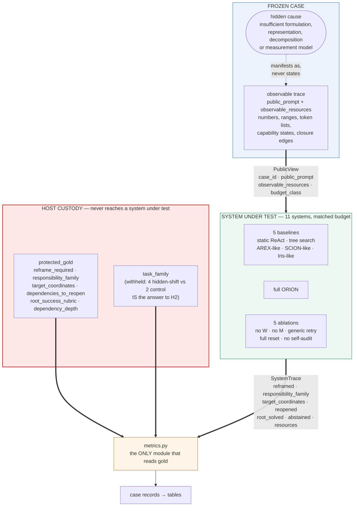

# ORION-11-1 — Protocol diagram

**Bound to:** protocol `ORION-11.hidden-formulation.v1.1`, suite PILOT `7a50a2d5…` /
TEST `21b461d8…`. Generated from the design, not from outcomes; this figure
carries no result and is publishable before the final test is run.

## What the evaluated system sees, and what it cannot

## Protected labels

Held by the host, never in a `PublicView`, enforced by the type signature
`SystemUnderTest.run(view: PublicView, *, seed: int)` rather than by discipline —
a system cannot reach gold because it is never handed an object that carries it.

| label | why it is protected |
|---|---|
| `reframe_required` | it *is* H2; a system that knows it needs no selectivity |
| `responsibility_family` | the attribution being measured |
| `target_coordinates` | the reframe target being measured |
| `dependencies_to_reopen` | the reopen set being measured |
| `task_family` | four families are hidden-shift and two are controls, so the family name restates `reframe_required` |
| `dependency_depth` | the H4 x-axis |

## Allowed interventions

A system may read the prompt and every listed resource, compute over them,
reframe, reopen prior closures, and answer or abstain. It may not read gold,
another system's trace, the case object, or any host path.

## What makes the observable trace sufficient without stating the cause

Verified rather than asserted, on the frozen suite:

| property | evidence |
|---|---|
| the cause is *derivable* from public content | independent audit: 55 of 66 SOLVABLE, 9 PARTIAL, 2 UNSOLVABLE |
| the cause is not *stated* | gold-vocabulary checker over prompt and resources |
| no single token predicts the label | `find_lexical_separators`: **0 separators from 906 tokens** |
| no surface statistic separates families | 16 surfaces × 2 statistics × 2 labellings × 2 splits, **0 Holm rejections** |
| no *interaction* of surfaces separates them | joint-space LOO 1-NN: TEST 0.062 vs 0.167 baseline, p=0.97 |
| no shape-only responder beats chance | kind-histogram 1-NN: 0.106 / 0.056 / 0.167 vs 0.167 baseline |
| the panel is not degenerate | `probe_records` CLEAN, pooled and per split |

## Declared limitations, carried in the figure rather than hidden below it

- A residual of low-level lexical cues remains at roughly 0.10 lift
  (`comma_count`, `prompt_sentences`, `digit_density`). Two exploitable rules
  were found and removed; with 48 cases and an unbounded space of text
  statistics some statistic always separates, so the floor is published rather
  than chased.
- The reopen null is the blind largest-component policy at **0.792 PILOT /
  0.823 TEST**, not the full-reset ablation at 0.719. A reopen result between
  those numbers is graph shape, not dependency-directed reasoning.
- INTERFACE and DECOMPOSITION are not mechanically separable from public text;
  the boundary rules emit both.
